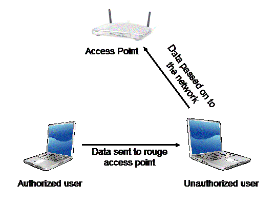
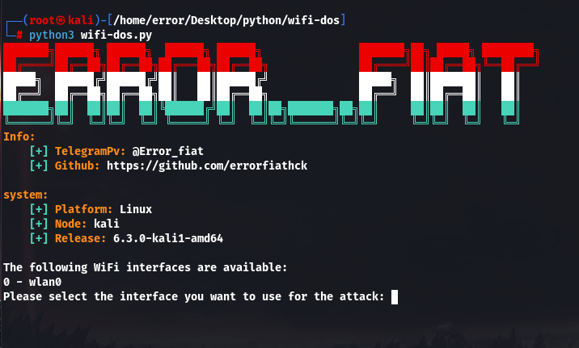

<br/>
<p align="center">
  <a href="https://github.com/ShaanCoding/ReadME-Generator">
    
  </a>

  <h3 align="center">Wifi Doser(deauthentication attack script)</h3>

  <p align="center">
    An simple wifi doser using python
    <br/>
    Note this project is done.
    <br/>
    <br/>
    <!-- <a href="https://readme.shaankhan.dev"><strong>View Demo »</strong></a> -->
    <br/>
    <br/>
    <a href="https://intsagram.com/error._.fiat">Our instagram page</a>
    .
    <a href="https://youtube.com/error_fiat">Our youtube chanel</a>
    .
    <a href="https://twitter.com/ErrorFiat">Our twitter page</a>
  </p>
</p>

## How is a DOS attack on a Wi-Fi network?

As we know, WiFi hacking is one of the most popular branches among hackers. Many people do not have enough knowledge about attacks related to Wi-Fi networks, so when they are attacked, they cannot defend against it. Next, we will examine one of the most famous hacking attacks called DOS (Denial of Service attacks). This attack is also known as deauthentication of Wi-Fi networks.

## How is deauthentication attack in Wi-Fi network?

In the deauthentication attack, an attacker sends fake packets to the Access Point and tries to disconnect all people who are connected to the modem or AP, and this connection will continue until the dos attack is stopped.



## Why deauthentication attack is done?

Maybe you will think why dos attack is done? Does the hacker want to block someone from connecting to the Wi-Fi network? The answer can be yes or no. Because people who are new to the world of hacking and security are most likely out of curiosity and aimless and do it just to disconnect people from the modem.

But the main purpose of this attack can be a far more dangerous incident. One of these events can be getting Handshake to hack your Wi-Fi password.

That is, after the person is exposed to the attack, when he tries to connect to his access point again, at the same time, the attacker performs a sniffing attack on his Wi-Fi network and listens to the communication between them. which can later obtain the original Wi-Fi password from the intercepted file (handshake).

## Dealing with Dos attack in Wi-Fi networks

We should always adhere to the saying "prevention is better than cure". So it is better to do the following to reduce Wi-Fi network attacks:

- Use WPA2-PSK or WPA2-Enterprise encryption.
- Always keep your modem firmware updated.
- Choose unguessable and complex passwords for your Wi-Fi network.
- Put the bssid name of your Wi-Fi network in Hidden mode.
- Limit the Wi-Fi signal so that it is available only in our place of use.
But by doing the mentioned steps, we are still at risk. The only way that can be useful when exposed to a Dos attack is to turn off the AP or modem. Although it is not a good method, it can prevent damage to your device.

## About The Project



Anyway, we can use this Python code to carry out this attack on home networks, but as mentioned before, you need a wireless network card to run this script, then you can test this type of attack, but in Note that it is not ethical to use this tool for a modem that does not belong to you.

## Built With

Whilst I was the main developer of this project, this project couldn't of even started without the help of these open source projects, special thanks to:

- [[Python]](https://www.python.org/)

## Getting Started

This is an example of how you may give instructions on setting up your project locally.
To get a local copy up and running follow these simple example steps.

### Prerequisites

This program has no pre-requisites

### Installation & Usage

1. Clone the repo

```sh
git clone https://github.com/ShaanCoding/ReadME-Generator.git
```

2. cd to directory & run the project
```sh
cd wifi-dos

sudo python3 wifi-dos.py

Have fun!
